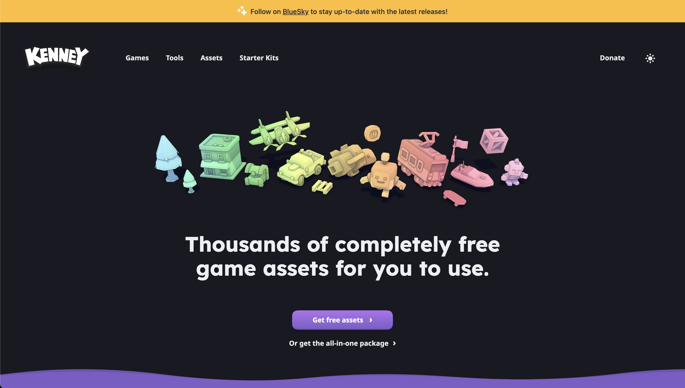

# 🕹️ README 04 — Kenney Assets + Polish

**Goal for today:** by the end of today, your platformer will stop looking like colored boxes and start looking like a real game using **Kenney sprites / tiles**.

You’re going to bounce between an **asset folder**, `script.js`, and maybe a little `style.css`.

---

## What you’re building today

- ✅ Replace plain rectangles with real images
- ✅ Use Kenney platformer tiles for platforms
- ✅ Use a sprite / image for the player
- ✅ Add a background image or simple parallax feel
- ✅ Make the game feel more polished

---

## Files you will touch today

* `script.js` → load and draw images
* `style.css` → optional crisp pixel settings
* your asset folder → where your Kenney PNGs live

Think of it like this:

* assets = **the art**
* JS = **where / when art gets drawn**
* CSS = **small visual cleanup**

---

## Tiny Vocabulary (only the new stuff today)

* **Sprite**: an image used in a game
* **Tile**: a repeated image block, usually for ground/platforms
* **drawImage()**: canvas method for drawing an image
* **Asset loading**: making sure images are ready before using them
* **Parallax**: background moves slower than foreground to fake depth

---

<details close>
<summary> <strong> <h1> 🗂️ 01: Organize your asset files </h1> </strong> </summary>

Before touching code, sure make your files are organized.

A clean folder structure might look like:

```txt
platformer/
├── index.html
├── style.css
├── script.js
└── assets/
    ├── player.png
    ├── ground.png
    ├── background.png
    ├── coin.png
    └── flag.png
```

Start simple. Just grab the images listed here:

For your first version, I would use:

* one player image
* one ground tile
* one background image
* one coin image
* one flag / goal image

### this matters

If your files are messy, your image paths will break and you’ll think your code is wrong when it’s really just the file path.

## We're going to get our asstes from: Kenny



[Kenny Link](https://kenney.nl/)

This is a really simple game assets library you can find online. Go to assets tab, and filter by 2D for this game and choose whatever pack you like. 

You will most likely get a folder/zip file, unzip it and pick which asstes you would like to use ( remember the list above ⬆️ ) 

---

</details>

<details close>
<summary> <strong> <h1> 🖼️ 02: Load your images in JavaScript </h1> </strong> </summary>

Before you can draw an image, JavaScript has to know it exists.

At the top of `script.js`, add:

```js
/********************
 Assets
********************/

const playerSprite = new Image();
playerSprite.src = "./assets/player.png";

const groundTile = new Image();
groundTile.src = "./assets/ground.png";

const backgroundImage = new Image();
backgroundImage.src = "./assets/background.png";

const coinSprite = new Image();
coinSprite.src = "./assets/coin.png";

const goalSprite = new Image();
goalSprite.src = "./assets/flag.png";
```

### What’s happening here

* `new Image()` creates an image object in JavaScript
* `.src = "..."` tells it where the file lives
* later, we’ll use `drawImage()` to actually place it on the canvas

### Important note

This does **not** draw anything yet.

It just says:

> “Hey JS, here are the images we plan to use.”

---

</details>

<details close>
<summary> <strong> <h1> ⏳ 03: Make sure the game waits for images </h1> </strong> </summary>

One annoying thing about images: they may not be ready instantly.

If the game starts before the images load, you may just see nothing.

A simple beginner-friendly fix is to start the game after the main image loads.

At the bottom of your file, instead of:

```js
gameLoop();
```

use:

```js
playerSprite.onload = () => {
  gameLoop();
};
```

### Why this helps

It tells JavaScript:

> “Wait until at least this image is loaded, then start the game.”

### Real talk

For a bigger game, you’d make a full loading system.

For a workshop, this is enough.

---

</details>

<details close>
<summary> <strong> <h1> 🧍 04: Replace the player rectangle with a sprite </h1> </strong> </summary>

Right now you probably have something like:

```js
ctx.fillStyle = "blue";
ctx.fillRect(player.x - camera.x, player.y, player.width, player.height);
```

Replace that with:

```js
ctx.drawImage(
  playerSprite,
  player.x - camera.x,
  player.y,
  player.width,
  player.height
);
```

### What `drawImage()` does

It means:

> “Draw this image at this x/y position, at this width/height.”

So:

* `playerSprite` = what image to draw
* `player.x - camera.x` = horizontal position
* `player.y` = vertical position
* `player.width`, `player.height` = size on screen

✅ Refresh and test. Your player should now be an image instead of a box.

NOTE: 
If your player looks distorted/too small or big ,  go ahead and resize them in their object declarations

```js
const player = {
  x: 100,
  y: 100,
  width: 75, // here
  height: 75, // here
  velocityX: 0,
  velocityY: 0,
};
```

The draw function width + height refers back to these since it only chnages the visual, not the physical (especially important for collisions)

You can do this with any of your sprites, 

---

</details>

<details close>
<summary> <strong> <h1> 🧱 05: Replace platform rectangles with tiles </h1> </strong> </summary>

This will probably be the biggest visual upgrade

Right now you might have:

```js
for (let platform of platforms) {
  ctx.fillStyle = "green";
  ctx.fillRect(platform.x - camera.x, platform.y, platform.width, platform.height);
}
```

That works, but stretching one tile across a long platform usually looks bad.

Instead, we’ll **repeat** a ground tile across the platform.

Replace your platform drawing with:

```js
for (let platform of platforms) {
  for (let x = platform.x; x < platform.x + platform.width; x += 32) {
    ctx.drawImage(
      groundTile,
      x - camera.x,
      platform.y,
      32,
      32
    );
  }
}
```

### What this does

Instead of saying:

> “Stretch one image across the whole platform”

we’re saying:

> “Draw many little tiles side by side.”

### Why `32`?

That’s the tile size we’re using here.

Kenney tiles are often:

* 16x16
* 32x32
* 64x64

You should pick a size and stay consistent.

### Important note

If your platform height is bigger than `32`, you may want to stack tiles vertically too.

For now, we’re keeping it simple and only doing one row of tiles because this is a workshop, not a full engine.

---

</details>

<details close>
<summary> <strong> <h1> 🌄 06: Add a background image </h1> </strong> </summary>

A background is one of the fastest ways to make the game feel finished.

If you have a background image, draw it near the start of your `gameLoop()` before platforms and player:

```js
function drawBackground() {
  ctx.drawImage(backgroundImage, 0, 0, canvas.width, canvas.height);
}

function gameLoop(){
  // camera and canvas code

  /// add your background  here

    drawBackground();

  //other draw code
    updatePlayer();
    drawGround();
    drawPlayer();
    drawCoins();
    drawGoal();
    gameWin();
    showScore();
}
```

### Why at the start?

Because canvas draws in layers.

Whatever gets drawn first goes in the back.

So your order should be something like:

1. background
2. platforms
3. coins
4. goal
5. player
6. score / text

### If your background image is smaller

You can still stretch it to fit the canvas while learning:


Later you can get more advanced.

---

</details>

<details close>
<summary> <strong> <h1> 🎥 07: Fake a simple parallax background </h1> </strong> </summary>

If you want the background to feel more “game-like,” you can move it slower than the world.

Instead of:

```js
ctx.drawImage(backgroundImage, 0, 0, canvas.width, canvas.height);
```

try: this goes into your `drawBackground()` function

```js
  // get the canvas width
  const bgWidth = canvas.width;

  // calculate for the camera offset
  let offset = (-camera.x * 0.2) % bgWidth;

  //tile the background the same way we did the ground to meet the full width
  for (let x = offset - bgWidth; x < canvas.width; x += bgWidth) {
    ctx.drawImage(backgroundImage, x, 0, bgWidth, canvas.height);
  }
```

### What this means

* foreground moves at full speed
* background moves at only 20% speed

That creates a fake depth effect called **parallax**

### Why the extra width?

If the background shifts left/right, giving it extra width helps avoid empty gaps.


---

</details>

<details close>
<summary> <strong> <h1> 🪙 08: Replace coins and goal with images </h1> </strong> </summary>

If you already drew coins as circles, replace that with:

```js
for (let coin of coins) {
  if (!coin.collected) {
    ctx.drawImage(
      coinSprite,
      coin.x - camera.x - coin.size / 2,
      coin.y - coin.size / 2,
      coin.size,
      coin.size
    );
  }
}
```

And for your goal:

```js
ctx.drawImage(
  goalSprite,
  goal.x - camera.x,
  goal.y,
  goal.width,
  goal.height
);
```

### Why the coin math looks weird

Coins are often stored by their center point.

Images draw from the **top-left corner**.

So we subtract half the size to center the image properly.

---

</details>

<details close>
<summary> <strong> <h1> ✨ 09: Add small polish touches </h1> </strong> </summary>

These are tiny, but they help a lot.

### A) Make pixel art look crisp

In `style.css`, add:

```css
canvas {
  image-rendering: pixelated;
}
```

### Why this matters

Without this, pixel art can look blurry.

---

### B) Clamp the camera so it doesn’t show empty space

If your camera can scroll too far left or right, it might show weird blank space.

Add something like:

```js
camera.x = Math.max(0, player.x - canvas.width / 2);
```

And if you have a world width:

```js
camera.x = Math.min(camera.x, worldWidth - canvas.width);
```

### Why this matters

The camera should follow the player, but not drift outside the actual level.

---

### C) Give the player a consistent size

Sometimes sprites load with awkward proportions. It’s okay to resize them through code:

```js
player.width = 40;
player.height = 52;
```

This is normal.

You do **not** need the sprite’s original size to be the exact gameplay size.

Also you can do this with any of your sprites, if you'r coins or flags look weight go ahead and resize them in their object declarations

---

</details>

<details close>
<summary> <strong> <h1> 🧪 10: Keep the logic and visuals separate </h1> </strong> </summary>

This is one of the most important ideas in the whole workshop.

Your collision still uses data like:

```js
platform.x
platform.y
platform.width
platform.height
```

That means gameplay is based on invisible rectangles / rules.

The images are just what the player sees.

### Why this matters


> game logic and game art are not the same thing

That’s why we started with rectangles first.

Rectangles made the logic easier to learn.

Now that the logic works, we can “skin” the game with art.

---

</details>
